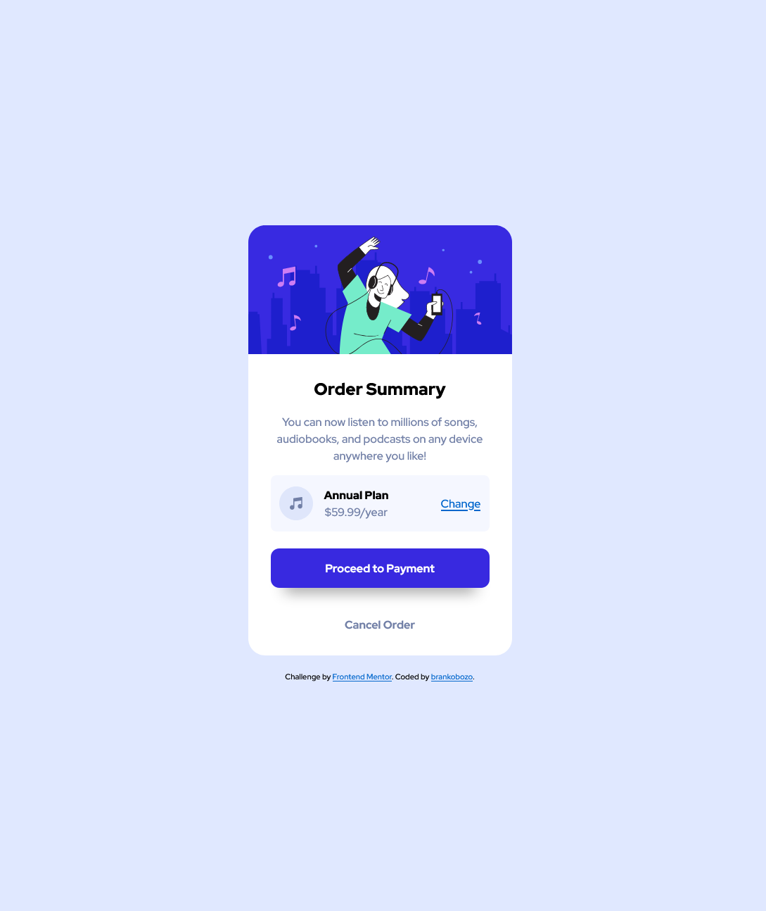

# Frontend Mentor - Order summary component

Solution to the [Frontend Mentor challenge](https://www.frontendmentor.io/challenges/order-summary-component-QlPmajDUj).

## The Challenge

Challenge is to build out order summary card component and get it looking as close to the design as possible.
Users should be able to see hover states for interactive elements.

## Links

- [Code](https://github.com/brankobozo/card-component-order-summary)
- [live](https://brankobozo.github.io/card-component-order-summary/)

## Screenshot

## Tools

- Semantic HTML5 markup
- CSS custom properties
- Flexbox
